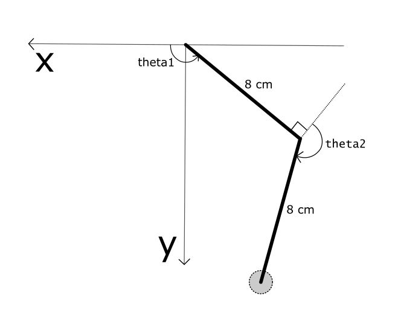

# sg90writer
Code for a shitty 2DoF robotic arm based writer which uses three SG90 servos.
It is programmed to write a couple of letters in the worst way possible. So keep your expectations as low as possible.
## geometry reference
if you plan to use this code, use the below diagram as reference.

